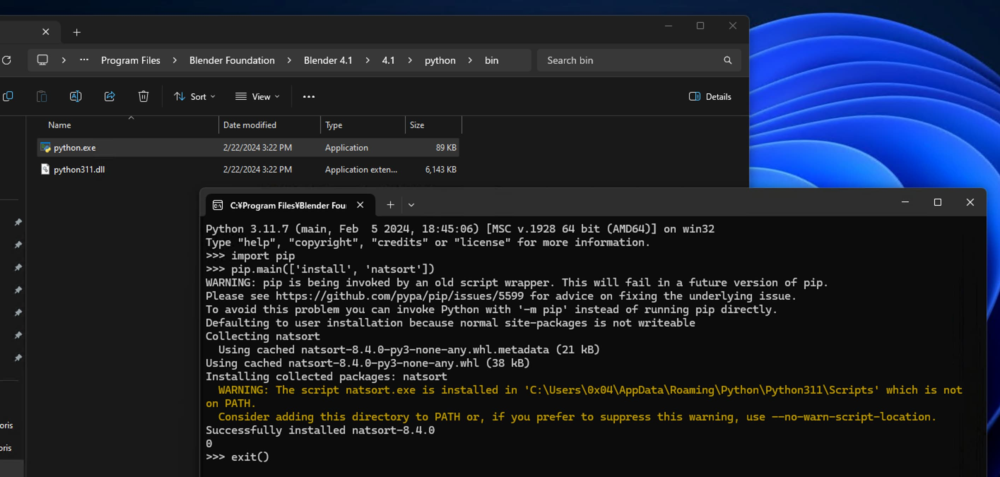

# mmd_tools_mod

[blender_mmd_tools](https://github.com/UuuNyaa/blender_mmd_tools) modifier 


## Installation

- Download the zip file from [releases](https://github.com/arch4e/mmd_tools_mod/releases) page
- Open the preference window via `Edit >> Preferences >> Add-ons >> Install`
- Enable `3D View: mmd_tools_mod`

### Option

If you wish to utilize natural sorting, you'll need to install the [natsort](https://pypi.org/project/natsort/) module.

#### Method 1: Adding via CLI

reference: [Directory Layout](https://docs.blender.org/manual/en/latest/advanced/blender_directory_layout.html)
```sh
# Windows
<blender app folder path>\<version>\python\bin\python.exe -m pip install natsort

# macOS
/Applications/Blender.app/Contents/Resources/<version>/python/bin/python3.X -m pip install natsort

# --- reference ---
# https://docs.blender.org/manual/en/latest/advanced/blender_directory_layout.html
```

#### Method 2: Using the Python interpreter




## Code Format

```
flake8 --exclude mmd_tools --ignore=E201,E202,E203,E221,E231,E261,W391,E501 .
```


## Dependencies

- [natsort](https://pypi.org/project/natsort/)


## License

GPLv3

